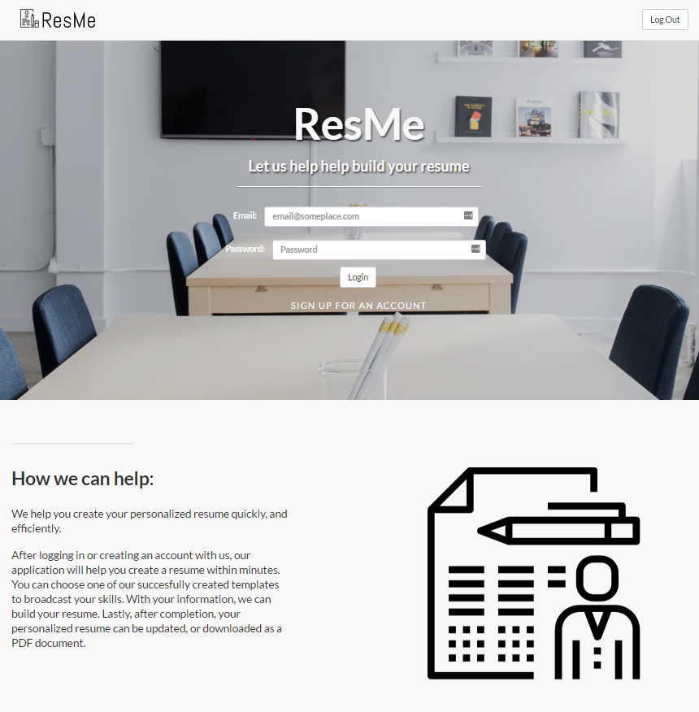

# ResMe
* Description: A full-stack application that helps create resumes quickly for the entry-level developer. 
* Motiation: Wanted to streamline the resume building process to make job searching easier for new developers. 
* Results: Application successfully creates resumes but does suffer from minimal styling issues due to the conversion of HTML code to PDF format. 
* Created by: Jessica Loch (Database & Backend), Stella Wu (Backend), An Huynh (Front End)

### [Demo!](https://resumeme.herokuapp.com/)

### How it works
* We help you create your personalized resume quickly, and efficiently.
* After logging in or creating an account with us, our application will help you create a resume within minutes. You can choose one of our succesfully created templates to broadcast your skills. With your information, we can build your resume. Lastly, after completion, your personalized resume can be updated, or downloaded as a PDF document.

### Technologies:
* Server - Node.js, Express framework
* Database - mySQL, Sequalize
* Client - Express-handlebars
* Npm modules: express, mysql, express-handlebars, bcrypt

### Design
* Model, View, Controller design pattern

### Challenges faced
* Serving dynamic error messages to the front end.

### Solution:
* Further understanding handlebars.
* Formatted each file in order to abide by handlebars documentation.

### Further Steps/Improvements:
* The team would like to take this application further by adding a user's home page to further edit their resumes, or create new ones while also saving other copies in different templates.
* The team would also like to create more templates for the user to choose from. 

#### Developed by An Huynh, Stella Wu, Jessica Loch